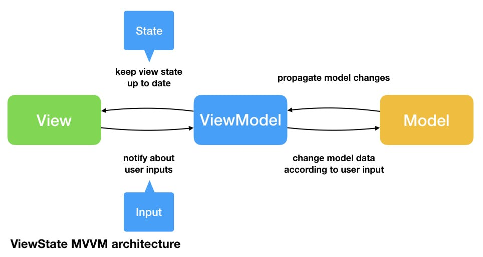

## iOS Base Project

> Sample project for iOS developer


<p></p>

#### Requirement
```
- Xcode 12.5+ 
```

### Getting Started
- Get api key [TheMovieDb](https://www.themoviedb.org/settings/api)
- Add api key themoviedb to `core/data/constant`, attribute `apiKey`

run this project

```
  sudo gem install cocoapods

  Pod install

```

### Pattern Architecture  
- MVVM



### Resource 
Separate resource for each features

```
Project Name
    │
    ├─── Core 
    │   │
    │   ├───Models
    │   │    ├───  login (feature name)
    │   │    └───  user
    │   │
    │   ├───Data
    │   │    └─ Constant
    │   │
    │   ├───Repositories
    │   │    ├───  Auth (feature repository)
    │   │    └───  Profile
    │   │
    │   └─── Network 
    │         
    │
    ├─── Module 
    │   │
    │   ├───Auth (module name)
    │   │    ├───  View
    │   │    └───  View Model
    │   │
    │   └─── Other Module
    │    
    └─── Shared
        ├───  Resource
        │     ├───  Asset
        │     ├───  Font
        │     ├───  Color 
        │     └───  Localizable
        │
        ├───  Views
        │     └───  all view component
        │
        └───  Utils
```

### Assets 
add image and color assets can be added in `Asset.xcassets and Color.xcasset`, for strings in `localizable.strings` file, and for external fonts in `Fonts` directory, all assets name will be generate using swiftgen [SwiftGen](https://github.com/SwiftGen/SwiftGen)

#### Libraries

* [Alamofire](https://cocoapods.org/pods/Alamofire)
* [Kingfisher](https://cocoapods.org/pods/kingfisher)
* [AlertToast](https://cocoapods.org/pods/AlertToast)
* [SwiftGen](https://github.com/SwiftGen/SwiftGen)